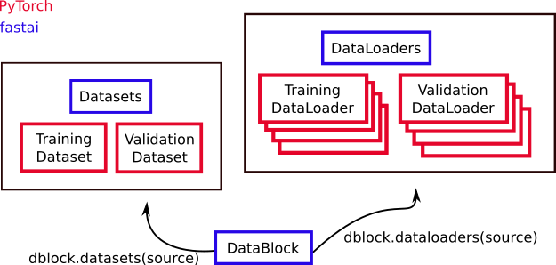

---
aliases:
- /markdown/2020/07/23/data_objects
categories:
- pytorch
date: '2020-07-23'
description: Data classes.
layout: post
title: DataPlox
toc: true

---

# DataPlox

In understanding how to properly feed young, growing models, it is useful to know some of the main data objects in PyTorch and fastai. Fastai extends many of the fundamental PyTorch objects. Here's the picture that I have in my head:



For the main PyTorch data classes:

* [Dataset](https://pytorch.org/docs/stable/data.html#torch.utils.data.Dataset)
* [DataLoader](https://pytorch.org/docs/stable/data.html#torch.utils.data.DataLoader)

The fastai library extends them with:

* [Datasets](http://dev.fast.ai/data.core#Datasets)
* [DataLoaders](https://dev.fast.ai/data.core#DataLoaders)

and adds a useful class which can help construct the others:

* [DataBlock](http://dev.fast.ai/data.block#DataBlock)

# DataBlock

This is a fastai object [which helps you build Datasets and DataLoaders](http://dev.fast.ai/data.block). In addition to Chapter 6 of the fastbook, there is also [a tutorial in the fastai docs](http://dev.fast.ai/tutorial.datablock). A DataBlock is a blueprint for how to build your data. You tell it:

* what kind of data you have (`blocks=`),
* how to get the input data (`get_x=` or `get_items=`),
* how to get the targets/labels (`get_y`),
* how to perform the train/validation split (`splitter=`),
* as well as any resizing (`items_tfms=`) or augmentations you want to be performed (`batch_tfms`).

By feeding these blue prints a source (like a directory on your computer), you can use a DataBlock to create a Datasets or DataLoaders object.

# Dataset

Dataset is a Torch object. We can find out exactly what a Dataset is because PyTorch is open source. We just have to be brave enough to parse some of the grittier implementation details.

According to [the source code](https://pytorch.org/docs/stable/_modules/torch/utils/data/dataset.html#Dataset) a Dataset is at its core something that allows you to grab an item if you provide the index/key for it and that you can also add items to. This is just the abstract class definition, essentially the bare bones of a what a dataset should be. If you try to make a class that inherits from `Dataset` you will get an error if you do not implement `__getitem__`, the method for grabbing items. It does this by setting the default behavior of that method to raise a `NotImplementedError`. You can also implement this behavior (forcing inheriting classes to define specific methods) by using the [abc package](https://docs.python.org/3/library/abc.html). The source code also mentions that it would have set a default for a length function, but the standard methods for making a default that is forced to change have conflicts with what a length function is "supposed" to do.

The types of Datasets are:

* IterableDataset
* TensorDataset
* ConcatDataset
* ChainDataset
* Subset

# Datasets

Datasets is an object that contains a training Dataset and a validation Dataset. You can generally construct a Datasets object from a DataBlock like this:

```python
dblock = DataBlock(blue_print_details)
dsets = dblock.datasets(source)
```

# DataLoader

A DataLoader is a Dataset together with a Sampler. A Sampler is a way to create an iterator out of your Dataset, so you can do things like consume data in batches as needed. Rather than take a Dataset an manually loop through chunks of it, at each step using a chunk to update a model, a DataLoader bundles this idea together. This makes a lot of sense to encapsulate: going through your data in batches is a frequently encountered process in machine learning!

We can see [from the source code](https://pytorch.org/docs/stable/_modules/torch/utils/data/sampler.html#Sampler) that a Sampler is at minimum:

* a way to iterate over indices of dataset elements (`__iter__`) and
* a way to calculate the size of the returned iterators (`__len__`).

Just like with `DataSet`, defining the length method is not strictly enforced by the interpreter because the various `NotImplemented` errors you can throw do not quite work.`

The kinds of samplers:

* `SequentialSampler` - go in direct 0, 1, 2, ... order.
* `RandomSampler` - randomly choose observations, with or without replacement (`replacement=`)
* `SubsetRandomSampler` - randomly sample from a provided subset of indices, without replacement
* `WeightedRandomSampler` - for non-uniform random sampling
* `BatchSampler` - generate mini-batches of indices

For DataLoader, the [definition is a bit more involved](https://pytorch.org/docs/stable/_modules/torch/utils/data/dataloader.html#DataLoader). In part, because it implements multiprocessing, but it also does things like creating a Sampler from the arguments if one wasn't provided.

# DataLoaders

DataLoaders is an object that contains a training DataLoader and a validation DataLoader. You can construct a DataLoaders from a DataBlock similarly to the Datasets method:

```python
dblock = DataBlock(blue_print_details)
dls = dblock.dataloaders(source)
```
